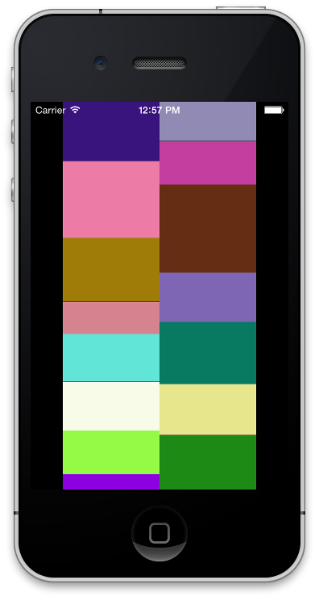

ARCollectionViewMasonryLayout
=============================

[](https://travis-ci.org/AshFurrow/ARCollectionViewMasonryLayout)

ARCollectionViewMasonryLayout is a `UICollectionViewLayout` subclass for creating flow-like layouts with dynamic widths or heights.



Usage
-----

Create an instance of a `ARCollectionViewMasonryLayout`.

```objc
ARCollectionViewMasonryLayout *layout = [[ARCollectionViewMasonryLayout alloc] initWithDirection:ARCollectionViewMasonryLayoutDirectionVertical];
```

Create a collection view. Its delegate *must* conform to the `ARCollectionViewMasonryLayoutDelegate` protocol in order to retrieve the variable dimensions of the cells.

```objc
@interface ARCollectionViewController : UICollectionViewController

@end
```

```objc
@interface ARCollectionViewController () <ARCollectionViewMasonryLayoutDelegate>

@end

@implementation ARCollectionViewController

#pragma mark - UIViewController Lifecycle and Callbacks

- (void)viewDidLoad
{
    [super viewDidLoad];
    [self.collectionView registerClass:[UICollectionViewCell class] forCellWithReuseIdentifier:@"Cell"];
}

#pragma mark - UICollectionViewDataSource Methods

- (NSInteger)collectionView:(UICollectionView *)collectionView numberOfItemsInSection:(NSInteger)section
{
    return 10;
}

- (UICollectionViewCell *)collectionView:(UICollectionView *)collectionView cellForItemAtIndexPath:(NSIndexPath *)indexPath {
    UICollectionViewCell *cell = [collectionView dequeueReusableCellWithReuseIdentifier:@"Cell" forIndexPath:indexPath];
    CGFloat colorSeed = (indexPath.row * 3 % 255)/255.0f; // random-ish color
    cell.backgroundColor = [UIColor colorWithRed:colorSeed green:colorSeed blue:colorSeed alpha:1];
    return cell;
}

#pragma mark - ARCollectionViewMasonryLayoutDelegate Methods

- (CGFloat)collectionView:(UICollectionView *)collectionView layout:(ARCollectionViewMasonryLayout *)collectionViewLayout variableDimensionForItemAtIndexPath:(NSIndexPath *)indexPath
{
    return (CGFloat)(indexPath.row * 10 % 30) + 40; // random-ish varying size
}

@end
```

Headers and Footers
-------------------

The masonry layout supports a fixed height header and footer that scroll along with the contents of the view. These can be added via a reusable view.

```objc
@interface ARCollectionViewReusableView : UICollectionReusableView

@end
```

```objc
@implementation ARCollectionViewReusableView

- (id)initWithFrame:(CGRect)frame
{
    self = [super initWithFrame:frame];
    if (!self) return nil;
    self.backgroundColor = [UIColor whiteColor];
    return self;
}

@end

```objc
ARCollectionViewMasonryLayout *layout = [[ARCollectionViewMasonryLayout alloc] initWithDirection:ARCollectionViewMasonryLayoutDirectionVertical];

// header class and height
layout.headerViewClass = [ARCollectionViewReusableView class];
layout.headerHeight = 10;

// footer class and height
layout.footerViewClass = [ARCollectionViewReusableView class];
layout.footerHeight = 44;
```

Demo Project
------------

This repository contains a demo project showing the use of the collection view layout. The view controller creates a number of `ARModel` instances which represent a color and dimension of a cell. These values are assigned from a collection of colors in `viewDidLoad`. When the collection view asks for a cell, the cell's background colour is set to the corresponding model's color. The layout queries the collection view's delegate for dimension information, and the corresponding model's dimension is returned.

License
-------

Licensed under MIT.

Credits
-------

Originally created by [Orta](https://github.com/orta) for [Artsy](https://artsy.net).
